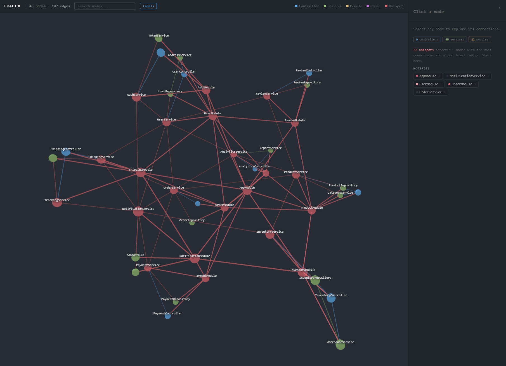
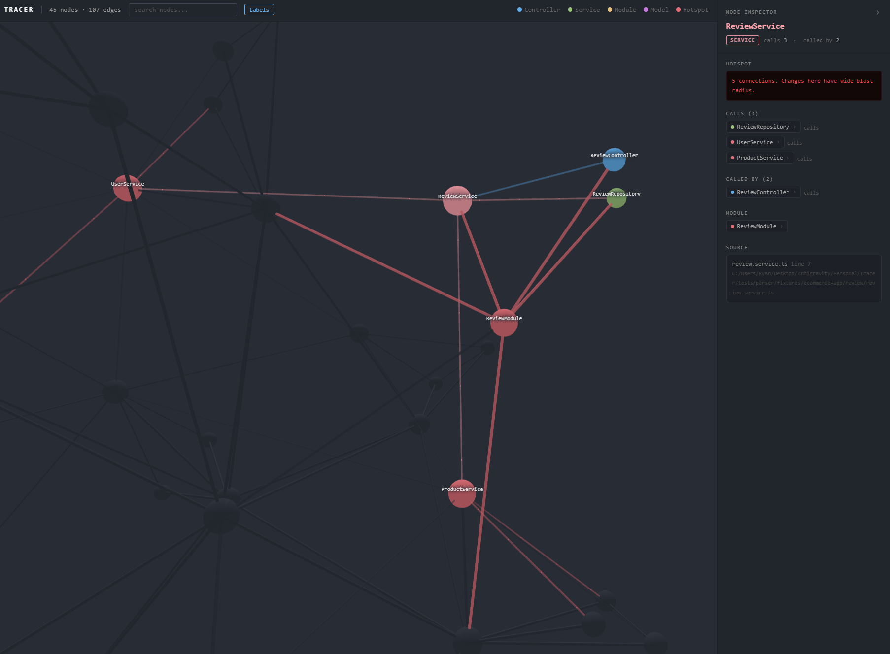

# Tracer

> Map your codebase architecture. Trace every connection before it breaks.

---


*The full architecture graph — controllers, services, modules, and models rendered as a live 3D force layout.*


*Clicking any node opens the inspector — HTTP routes, outgoing calls, callers, declaring module, and source location.*

---

## The Problem

Large codebases grow faster than anyone's understanding of them. Routes call controllers, controllers call services, services call models. Nobody has a complete picture of how it connects. When an engineer changes a model or refactors a service, they're guessing at the blast radius. When a PM scopes a feature, they're guessing at the complexity.

Architecture diagrams go stale the moment they're created. Code reviews catch bugs, not systemic impact. Onboarding a new engineer takes weeks because the structure lives nowhere.

Tracer reads the codebase and renders the architecture as a live, interactive graph.

---

## What It Does

Static analysis pipeline that scans a TypeScript/NestJS codebase, extracts every route, controller, service, and model, builds a dependency graph, and renders it in the browser. One command, no setup.

**What gets mapped:** Controllers, services, modules, models, HTTP routes, dependency injection chains

**Output:** An interactive node graph in your browser. Click any node to inspect its connections. Hotspots flagged automatically.

---

## Architecture

```
[tracer scan ./project]
        |
File Walker
(finds .ts files across the project)
        |
tree-sitter Parser
  |- Controller extractor   (@Controller, @Get, @Post, @Put, @Delete)
  |- Service extractor      (@Injectable, constructor dependencies)
  |- Module extractor       (@Module, imports, providers)
  +- Model extractor        (TypeORM @Entity, relations)
        |
Graph Builder
(resolves dependencies into nodes and edges, computes connection counts)
        |
SQLite Storage
(graph persisted locally)
        |
[tracer serve]
        |
Local Server (localhost:2929)
  +- GET /api/graph
        |
Browser UI (Cytoscape.js)
(interactive graph: pan, zoom, click to inspect)
```

---

## Design Decisions

**Static analysis only.** Tracer never executes code it finds. Every node and edge comes from the AST. If the graph cannot prove a connection exists, it does not show it.

**tree-sitter over regex.** Regex parsers fail on real codebases. tree-sitter's TypeScript grammar handles edge cases correctly and produces a structured AST that makes extraction deterministic.

**NestJS first.** NestJS decorators (@Controller, @Injectable, @Module) make routes and dependencies explicit in source. This gives the parser reliable signal and produces a clear graph on first render.

**Local SQLite before cloud sync.** The graph is stored locally. No data leaves the machine without explicit action. Codebases contain proprietary code and architecture details. Local-first is the correct default.

**CLI before UI.** Engineers trust tools they can script. `tracer scan` and `tracer serve` work independently. The browser view is a rendering layer on top of a CLI core.

---

## Build Phases

- [x] **Project scaffold:** CLI, parser, graph, server, UI structure with full TypeScript types
- [ ] **NestJS parser:** tree-sitter extraction for controllers, services, modules, models
- [ ] **Graph builder:** node and edge construction, hotspot detection
- [ ] **SQLite storage:** persist and load graph locally
- [ ] **Local server:** Express API serving graph data
- [ ] **Browser UI:** Cytoscape.js rendering, click to inspect

---

## Roadmap

| Version | Target | Focus |
|---|---|---|
| v1 | TypeScript / NestJS | Core parser, graph, browser UI |
| v2 | TypeScript / Express + VS Code | Express support, editor extension, click to source |
| v3 | Python / FastAPI | Cross-language support, CI/CD integration |
| v4 | Go / Gin | Monorepo support, AI-assisted impact prediction |

---

## Quick Start

```bash
npx tracer scan ./your-nestjs-project
npx tracer serve
```

Opens at `http://localhost:2929`

---

## Development

```bash
npm install
npm run dev -- scan ./path/to/project
npm test
```

---

## Files

```
src/
  cli/          command entry point, scan and serve
  parser/       tree-sitter parsing, NestJS extractors
  graph/        graph builder, SQLite storage, types
  server/       local Express server, API routes
  ui/           browser frontend, Cytoscape renderer
tests/
  parser/       unit tests and real-world fixtures
  graph/        builder and storage tests
docs/
  architecture  system design
  roadmap       version targets
```
